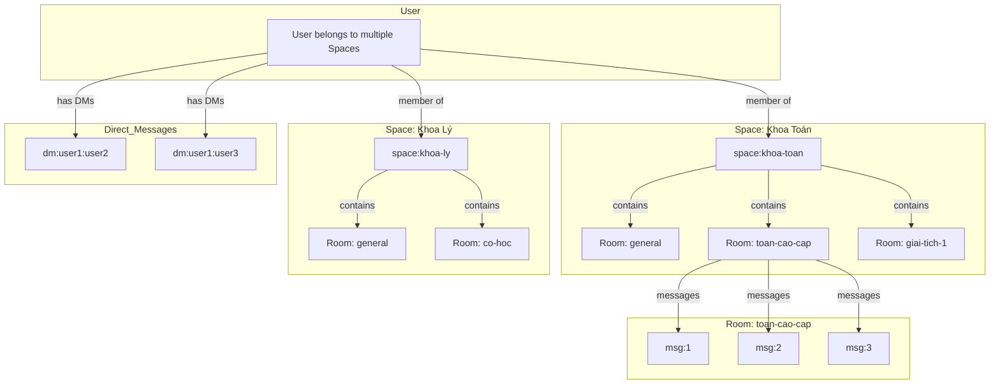

# Redis Data Structure Design for Chat Application

## Overview

This document outlines the Redis data structure design for a chat application supporting:

- **Spaces**: Container for multiple rooms (e.g., "Khoa Toán", "Khoa Lý")
- **Rooms**: Individual chat rooms within a space (e.g., "Toán cao cấp", "Giải tích 1")
- **Direct Messages (DM)**: 1-on-1 conversations
- **Messages**: Chat messages within each room
- **Reactions**: Emoji reactions to messages
- **Reply**: Threaded replies to messages
- **Edit**: Message editing with history
- **@Mentions**: Tagging users in messages

### Hierarchy

```
Space
├── Room 1 (e.g., "general")
│   ├── Message 1
│   ├── Message 2
│   └── ...
├── Room 2 (e.g., "toan-cao-cap")
│   ├── Message 1
│   └── ...
└── Room N
Direct Messages (separate from Space)
├── DM with User A
└── DM with User B
```

---

## Key Naming Convention

```
{prefix}:{entity}:{id}:{field}
```

Prefixes:

- `space:` - Spaces (containers)
- `room:` - Rooms within spaces
- `msg:` - Messages
- `dm:` - Direct messages
- `user:` - User data
- `react:` - Reactions
- `mention:` - Mentions

---

## 1. Message Storage

### Message Hash

Each message stored as a Redis Hash:

```
msg:{messageId}
  ├── id: "12345"
  ├── roomId: "toan-cao-cap"
  ├── spaceId: "khoa-toan" (null for DM messages)
  ├── roomType: "space" | "dm"
  ├── senderId: "user123"
  ├── senderName: "Minh"
  ├── content: "Hello @Linh, check this out!" (raw text with @mentions)
  ├── mentions: JSON string of parsed mentions [{userId, username, position}]
  ├── timestamp: 1712345678000 (Unix ms)
  ├── edited: "false" | "true"
  ├── editHistory: JSON string of edits
  ├── replyTo: "98765" (messageId being replied to)
  ├── pinned: "false" | "true"
  ├── deleted: "false" | "true"
  └── attachment: JSON string if has attachment
```

### Mentions Parsing

The `mentions` field stores parsed mention data to distinguish between @tags and plain text:

```json
[
  { "userId": "user456", "username": "Linh", "position": 6 },
  { "userId": "user789", "username": "Huy", "position": 25 }
]
```

**Example:**

Message content: `"Hello @Linh, check @Huy's work"`

- `content`: Raw text as displayed (includes @Linh, @Huy as text)
- `mentions`: Parsed array linking @Linh → user456, @Huy → user789

This allows:

- Rendering @mentions as clickable links in UI
- Distinguishing @email.com (not a mention) from @Linh (actual mention)
- Quick lookup of who was mentioned without parsing content

### Message with spaceId Example

```
HSET msg:12345 id "12345"
HSET msg:12345 roomId "toan-cao-cap"
HSET msg:12345 spaceId "khoa-toan"
HSET msg:12345 content "Hello @Linh, check this out!"
HSET msg:12345 mentions '[{"userId":"user456","username":"Linh","position":6}]'
```

### Message Lists (Sorted Sets for ordering)

**For Space/Room messages:**

```
room:messages:{roomId}
  ├── member: messageId, score: timestamp
```

**For DM messages:**

```
dm:messages:{dmId}
  ├── member: messageId, score: timestamp
```

**Example:**

```
ZADD room:messages:toan-cao-cap 1712345678000 msg:12345
ZADD dm:messages:dm:minh:you 1712345678000 msg:12345
```

---

## 2. Space Storage

### Space Hash

Each Space is a container that holds multiple rooms:

```
space:{spaceId}
  ├── id: "khoa-toan"
  ├── name: "Khoa Toán"
  ├── description: "Khoa Toán - Trường Đại học XYZ"
  ├── avatar: "https://..."
  ├── createdAt: 1712345678000
  ├── createdBy: "user123"
  ├── roomCount: 5
  ├── memberCount: 150
  └── lastActivity: 1712345678000
```

### Space Rooms List (Set)

Rooms belonging to a space:

```
space:rooms:{spaceId}
  ├── member: roomId (e.g., "general", "toan-cao-cap", "giai-tich-1")
```

**Example:**

```
SADD space:rooms:khoa-toan general
SADD space:rooms:khoa-toan toan-cao-cap
SADD space:rooms:khoa-toan giai-tich-1
```

### Space Members (Set)

Users who are members of the space (can access all rooms):

```
space:members:{spaceId}
  ├── member: userId
```

### Space Rooms Metadata (Hash)

Quick lookup for room info within space:

```
space:roominfo:{spaceId}:{roomId}
  ├── name: "Toán cao cấp"
  ├── description: "Phòng thảo luận Toán cao cấp"
  ├── createdAt: 1712345678000
  ├── memberCount: 45
  └── lastMessageAt: 1712345678000
```

### User's Spaces List (Sorted Set)

Spaces a user belongs to, sorted by last activity:

```
user:spaces:{userId}
  ├── member: spaceId, score: lastActivity
```

---

## 3. Room Storage

### Room Hash

Each Room belongs to a Space and contains messages:

```
room:{roomId}
  ├── id: "toan-cao-cap"
  ├── name: "Toán cao cấp"
  ├── spaceId: "khoa-toan"
  ├── description: "Phòng thảo luận Toán cao cấp"
  ├── createdAt: 1712345678000
  ├── createdBy: "user123"
  ├── memberCount: 45
  ├── messageCount: 1523
  └── lastActivity: 1712345678000
```

### Room Members (Set)

Users who can access this room:

```
room:members:{roomId}
  ├── member: userId
```

### Room Message Count

```
room:msgcount:{roomId} = 1523
```

### Room Pinned Messages (Set)

```
room:pinned:{roomId}
  ├── member: messageId
```

---

## 4. Direct Message Storage

### DM Room ID Generation

```
dm:{userId1}:{userId2}  (sorted alphabetically)
Example: dm:minh:you
```

### DM Metadata

```
dm:{dmId}
  ├── id: "dm:minh:you"
  ├── user1Id: "minh"
  ├── user2Id: "you"
  ├── lastMessageId: "msg:12345"
  ├── lastMessageAt: 1712345678000
  └── unreadCount:{userId}: 3
```

### User's DM List (Sorted Set)

```
user:dms:{userId}
  ├── member: dmId, score: lastMessageAt
```

---

## 5. Reactions Storage

### Message Reactions (Hash)

```
react:msg:{messageId}
  ├── 👍: JSON string of {count, users: ["user1", "user2"]}
  ├── ❤️: JSON string of {count, users: ["user3"]}
  └── 😂: JSON string of {count, users: ["user1", "user4"]}
```

### User's Reactions (Set) - for quick lookup

```
user:reactions:{userId}
  ├── member: "{messageId}:{emoji}"
```

**Example:**

```
HSET react:msg:12345 👍 '{"count":2,"users":["user1","user2"]}'
SADD user:reactions:user1 "12345:👍"
```

---

## 6. Reply/Thread Storage

### Reply Index

```
msg:replies:{parentMessageId}
  ├── member: replyMessageId, score: timestamp
```

### Message Reply Count

```
msg:replycount:{messageId} = 5
```

---

## 7. Edit History Storage

### Edit History (List)

```
msg:edithistory:{messageId}
  ├── LPUSH: JSON string of {content, editedAt, editedBy}
```

**Example:**

```
LPUSH msg:edithistory:12345 '{"content":"Original text","editedAt":1712345600000,"editedBy":"user1"}'
LPUSH msg:edithistory:12345 '{"content":"Edited text","editedAt":1712345678000,"editedBy":"user1"}'
```

---

## 8. @Mentions Storage

### Message Mentions (Set)

```
mention:msg:{messageId}
  ├── member: mentionedUserId
```

### User's Mentions (Sorted Set) - for notification

```
user:mentions:{userId}
  ├── member: messageId, score: timestamp
```

### Unread Mentions Count

```
user:mentioncount:{userId} = 3
```

**Example:**

```
SADD mention:msg:12345 user456
ZADD user:mentions:user456 1712345678000 msg:12345
INCR user:mentioncount:user456
```

---

## 9. Unread Count Storage

### User's Unread per Room

```
user:unread:{userId}:{roomId} = 5
```

### User's Total Unread

```
user:unreadtotal:{userId} = 23
```

---

## 10. Pinned Messages

(Moved to Room Storage section - `room:pinned:{roomId}`)

---

## 11. User Online Status

### User Status (Hash)

```
user:status:{userId}
  ├── online: "true" | "false"
  ├── lastSeen: 1712345678000
  └── socketId: "socket123" (for real-time)
```

### Online Users (Set)

```
users:online
  ├── member: userId
```

---

## Architecture Diagram



---

## Data Flow Examples

### Creating a Space with Rooms

```
1. Create Space
   - HSET space:{spaceId} {fields}
   - SADD user:spaces:{userId} {spaceId}

2. Add Rooms to Space
   - SADD space:rooms:{spaceId} general
   - SADD space:rooms:{spaceId} toan-cao-cap
   - HSET room:general {fields with spaceId}
   - HSET room:toan-cao-cap {fields with spaceId}

3. Add Members to Space
   - SADD space:members:{spaceId} {userId}

4. Add Members to each Room
   - SADD room:members:general {userId}
   - SADD room:members:toan-cao-cap {userId}
```

### Sending a Message in a Room

```
1. Generate messageId
2. HSET msg:{messageId} {fields}
   - roomId: "toan-cao-cap"
   - spaceId: "khoa-toan"
3. ZADD room:messages:{roomId} {timestamp} {messageId}
4. If has mentions:
   - SADD mention:msg:{messageId} {mentionedUserIds}
   - ZADD user:mentions:{userId} {timestamp} {messageId}
5. If reply:
   - ZADD msg:replies:{replyToId} {timestamp} {messageId}
6. Update room last activity
   - HSET room:{roomId} lastActivity {timestamp}
7. Update space last activity
   - HSET space:{spaceId} lastActivity {timestamp}
8. Increment unread counts for other room members
9. Publish to Redis Pub/Sub for real-time
   - PUBLISH channel:room:{roomId} message:new
```

### Adding a Reaction

```
1. HGET react:msg:{messageId} {emoji}
2. Update count and users array
3. HSET react:msg:{messageId} {emoji} {updatedJson}
4. SADD user:reactions:{userId} "{messageId}:{emoji}"
5. Publish reaction update
```

### Editing a Message

```
1. HGET msg:{messageId} content (store old content)
2. LPUSH msg:edithistory:{messageId} {oldContentJson}
3. HSET msg:{messageId} content {newContent}
4. HSET msg:{messageId} edited "true"
5. Publish edit update
```

---

## Redis Pub/Sub Channels

```
# Room message events
channel:room:{roomId}
  ├── message:new
  ├── message:edit
  ├── message:delete
  ├── reaction:add
  ├── reaction:remove

# DM events
channel:dm:{dmId}
  ├── message:new
  ├── message:edit
  ├── typing:start
  ├── typing:stop

# User events
channel:user:{userId}
  ├── mention:new
  ├── dm:new
  ├── status:change
```

---

## Caching Strategy

### Hot Data (Keep in Redis)

- Recent messages (last 100 per room)
- Online users
- Unread counts
- Recent reactions

### Warm Data (Redis + DB)

- Message history (older messages)
- User profiles
- Room metadata

### Cold Data (DB only)

- Very old messages (archive)
- Edit history (older than 30 days)
- Deleted messages

---

## Memory Optimization

### Use Redis Modules

- **RedisJSON**: For nested data (reactions, attachments)
- **RedisSearch**: For message search
- **RedisTimeSeries**: For analytics

### Compression

- Compress large message content
- Use message IDs instead of full objects in lists

### Expiration

```
EXPIRE msg:edithistory:{messageId} 2592000  # 30 days
EXPIRE user:mentions:{userId} 604800  # 7 days (keep recent)
```

---

## Example: Complete Message Object in Redis

```
# Message Hash (with spaceId and parsed mentions)
HSETALL msg:1712345678001 {
  "id": "1712345678001",
  "roomId": "toan-cao-cap",
  "spaceId": "khoa-toan",
  "roomType": "space",
  "senderId": "user123",
  "senderName": "Minh",
  "content": "Cho mình hỏi thêm: tích phân của sin(x) từ 0 đến π bằng bao nhiêu? @Linh @Huy giúp mình với",
  "mentions": "[{\"userId\":\"user456\",\"username\":\"Linh\",\"position\":78},{\"userId\":\"user789\",\"username\":\"Huy\",\"position\":84}]",
  "timestamp": 1712345678001,
  "edited": "false",
  "replyTo": "1712345678000",
  "pinned": "false",
  "deleted": "false"
}

# Reactions
HSETALL react:msg:1712345678001 {
  "👍": "{\"count\":2,\"users\":[\"user456\",\"user789\"]}",
  "❤️": "{\"count\":1,\"users\":[\"user456\"]}"
}

# Mentions Index (for notifications - separate from parsed mentions in message)
SADD mention:msg:1712345678001 user456 user789
ZADD user:mentions:user456 1712345678001 msg:1712345678001
ZADD user:mentions:user789 1712345678001 msg:1712345678001

# Add to room messages
ZADD room:messages:toan-cao-cap 1712345678001 msg:1712345678001

# Add to reply thread
ZADD msg:replies:1712345678000 1712345678001 msg:1712345678001
```

### How Mentions Work

1. **In Message Hash (`mentions` field)**: Stores parsed mention data as JSON
   - Used for rendering @mentions as clickable links in UI
   - Distinguishes @Linh (mention) from @gmail.com (not a mention)

2. **In Mentions Index (`mention:msg:{id}`, `user:mentions:{userId}`)**: Used for notifications
   - Quick lookup of who was mentioned
   - Track unread mentions per user

```
# Example: Parsing mentions from content
Content: "Contact me at test@email.com or @Linh for help"

Parsed mentions:
[
  { "userId": "user456", "username": "Linh", "position": 37 }
]

# @email.com is NOT a mention (no @ symbol followed by username pattern)
# @Linh IS a mention (matches @username pattern)
```

---

## Scaling Considerations

### Sharding

- Shard by roomId for room messages
- Shard by userId for user-specific data

### Clustering

- Use Redis Cluster for horizontal scaling
- Hash slots based on roomId/userId

### Persistence

- AOF (Append Only File) for durability
- RDB snapshots for backup

---

## Summary Table

| Feature       | Redis Structure   | Key Pattern                                  | Notes                                    |
| ------------- | ----------------- | -------------------------------------------- | ---------------------------------------- |
| Spaces        | Hash + Set        | `space:{id}`, `space:rooms:{spaceId}`        | Container for multiple rooms             |
| Space Members | Set               | `space:members:{spaceId}`                    | Users in the space                       |
| User Spaces   | Sorted Set        | `user:spaces:{userId}`                       | Spaces user belongs to                   |
| Rooms         | Hash + Set        | `room:{id}`, `room:members:{roomId}`         | Each room belongs to a space             |
| Room Messages | Sorted Set        | `room:messages:{roomId}`                     | Messages in a room, ordered by timestamp |
| Messages      | Hash              | `msg:{id}`                                   | Includes spaceId, mentions JSON          |
| DM            | Hash + Sorted Set | `dm:{id}`, `dm:messages:{dmId}`              | Direct messages (no spaceId)             |
| Reactions     | Hash + Set        | `react:msg:{id}`, `user:reactions:{userId}`  | Emoji reactions per message              |
| Reply         | Sorted Set        | `msg:replies:{parentId}`                     | Thread replies                           |
| Edit          | List              | `msg:edithistory:{id}`                       | Message edit history                     |
| @Mentions     | Set + Sorted Set  | `mention:msg:{id}`, `user:mentions:{userId}` | Notifications for mentions               |
| Unread        | String            | `user:unread:{userId}:{roomId}`              | Unread count per room                    |
| Online        | Set + Hash        | `users:online`, `user:status:{id}`           | User online status                       |
| Pinned        | Set               | `room:pinned:{roomId}`                       | Pinned messages per room                 |
